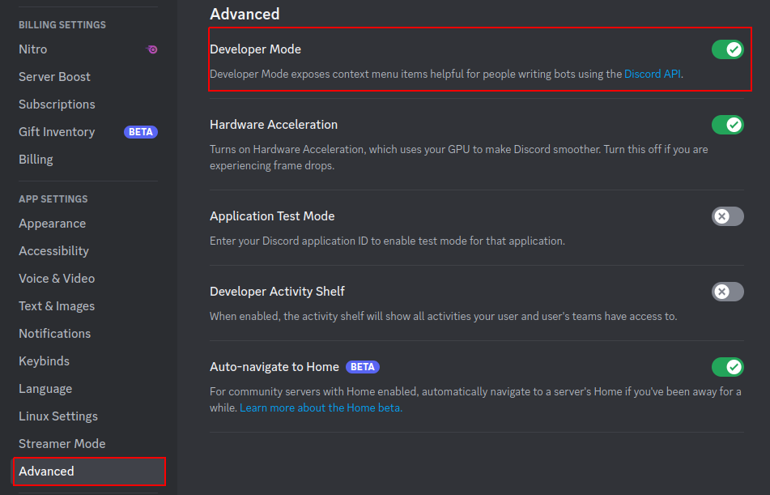
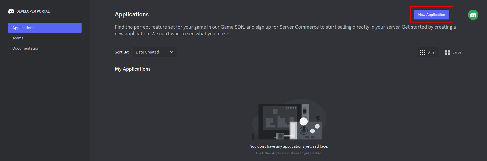
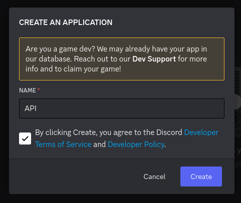
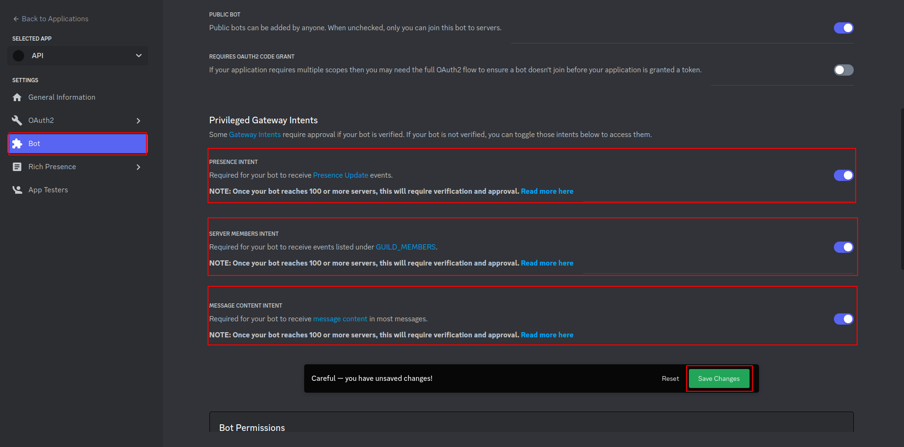
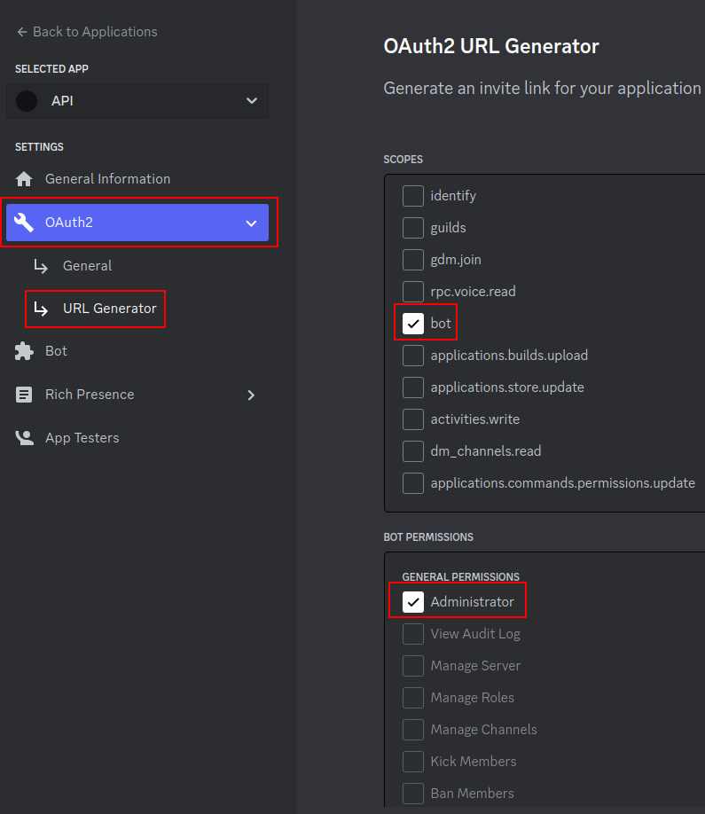
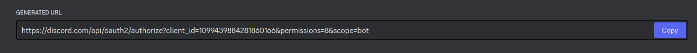
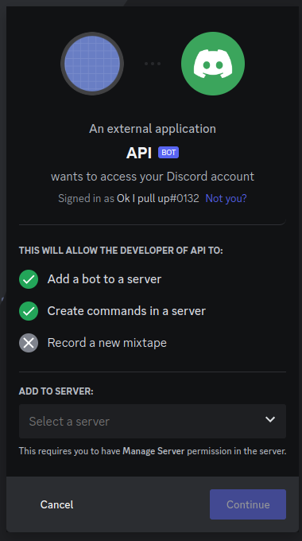

# Discord User Information - RestAPI (dui-api)

This repository contains a Docker Container to host a Discord Bot which collects the current data of every user (Name, Tag, Avatar, Banner, Status, Activities) of the first server its in. It can only track the users of one server. The bot is not meant to be used on more than one server. You can access all data via a RestAPI.

## Content

- ##### [Packages](##Packages)

  - [pip packages](###pip packages)
  - [apt packages](###apt packages)

- ##### [Docker Images](##Docker Images)

  - [MariaDB](###MariaDB)
  
- ##### [Installation](##Installation)

  - [Creating a discord bot](###Creating a discord bot)
  - [Hosting the API](###Hosting the API)

## Packages

### pip packages

#### mysql-connector-python

```bash
pip install mysql-connector-python
```

mysql-connector-python is used to connect to a MySQL database. In this case it's a dependency for mariadb, so it's needed to install the [mariadb python package.](####mariadb)

#### mariadb

```bash
pip install mariadb
```

We use mariadb to connect to the database of the api. To install the mariadb python package [these](####libmariadb3 and libmariadb-dev) repository packages have to be installed.

#### discord

```bash
pip install discord
```

This is a "modern, easy to use, feature-rich, and async ready API wrapper for Discord" like they say on their website. (https://discordpy.readthedocs.io/en/stable/) Using this module your Discord-Bot can get all the information which is saved in the database.

#### flask

````bash
pip install flask
````

Flask is a python web micro framework. In this project it is used to host the RestAPI.

#### cors

```bash
pip install flask_cors
```

cors is used to send and receive http requests.

### apt packages

#### libmariadb3 and libmariadb-dev

```bash
sudo apt install libmariadb3 libmariadb-dev
```

These two packages are the C Connector for mariadb and are dependencies for the [mariadb python package.](####mariadb)

## Docker Images

### MariaDB

The MariaDB docker image is where all the user data is stored your discord Bot collects is stored. 

### Adminer

The Adminer Image is used to access the MariaDB database through a web interface and can be accessed with

http://localhost:8080.

## Installation

#### Creating a discord bot

First of all, make sure that you have enabled the Discord Developer Mode in your settings: 




Next, you have to go to [this](https://discord.com/developers/applications) site (if you need to log in using your discord account) and create a new Application:




Give your Bot a name and accept the Developer Terms of Service and Developer Policy (after you read it):



Now go to "Bot", scroll down and enable all options in "Privileged Gateway Intents" and save your changes:



Next, you'll need to invite the bot to your server: Navigate to OAuth2 > URL Generator:



After selecting "bot" and "Administrator", scroll down and copy the URL.



Create a new Tab, paste the URL and invite the Bot to your Server:



That's it! you created a new Bot and invited it to your server.

NOTE: Make sure to make everyone in your server know that you are tracking their account information (Name, Tag, Avatar, Banner, Status, Activities)!

#### Hosting the API

To host the API you need Docker installed on your Machine. For Instructions head [here](https://docs.docker.com/get-docker/). Docker is available for Windows, MacOS and Linux. For the docker-compose.yml file to work you need to set up a docker network using the following command:

```bash
docker network create discord-net
```

Next, clone this Repository using

```bash
git clone https://github.com/leanderlist/dui-api
```

Use `cd dui-api` on Mac or Linux, or `dir dui-api` to navigate into the Repository. 

If you wish to access the database you can leave the adminer section in the docker-compose file but if you don't want to you can just delete this part of the file. To start the Docker Container use `docker-compose up -d` on Windows or `docker compose up -d` on Linux and Mac. After you started the container you should be able to access the RestAPI through port 80 and Adminer through port 8080.

